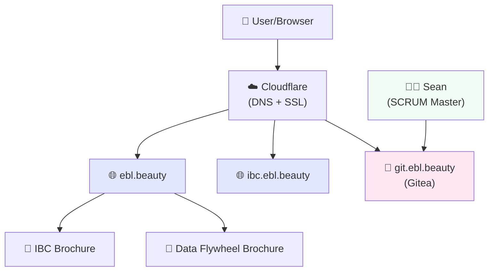
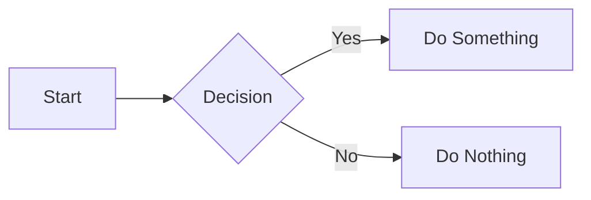
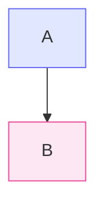
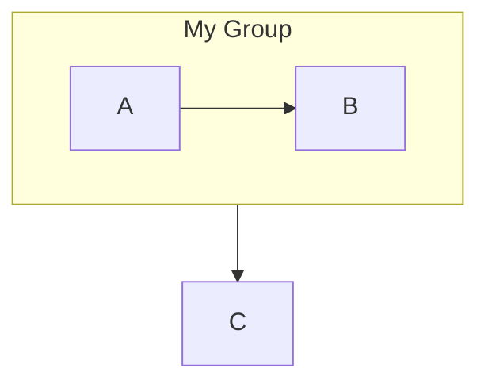

# 🏛️ Briefing for Sean - SOLVY / SOVEREIGNITITY™

## The Big Picture (For Sean)

We're building **SOLVY** — a cooperative neobank for IBC (Infinite Banking Concept) practitioners. Think "credit union meets fintech" with a focus on economic sovereignty.

---

## 📊 Visual Architecture

---

## 🗂️ What We Have Built

### Websites (VPS - 46.62.235.95)
| Site | URL | Purpose |
|------|-----|---------|
| **Main Brochure** | https://ebl.beauty | Landing page with IBC vs SPS choice |
| **IBC Practitioners** | https://ebl.beauty/ibc/ | PDF brochure for banking folks |
| **Strategic Partners** | https://ebl.beauty/sps/ | PDF brochure for partnerships |
| **IBC Portal** | https://ibc.ebl.beauty | Original IBC presentation site |
| **Git Server** | https://git.ebl.beauty *(pending DNS)* | Code repository (Gitea) |

### Code Repositories (Moving to Gitea)
- `sovereignitity-site` — The brochure HTML/CSS/JS
- `solvy-platform` — Main application

---

## 🎯 What We Need From Sean (Eventually)

**NOT urgent** — he can help when he has bandwidth:

1. **Review the brochure sites** — Are they clear to non-technical people?
2. **Sprint planning** — If/when we formalize development cycles
3. **Process advice** — How to track features/issues without full Agile overhead

**For now:** Just skim the sites and give feedback when he has 10 minutes.

---

## 📚 Mermaid Diagram Cheatsheet

Mermaid lets you draw diagrams with text. Here's how:

### Basic Flowchart

### Types of Nodes
| Syntax | Result |
|--------|--------|
| `A[Text]` | Box |
| `A(Text)` | Rounded box |
| `A{Text}` | Diamond (decision) |
| `A((Text))` | Circle |
| `A[/Text/]` | Parallelogram |

### Directions
- `TB` = Top to Bottom
- `LR` = Left to Right
- `RL` = Right to Left
- `BT` = Bottom to Top

### Styling

### Subgraphs (Groups)

---

## 🚀 Current Status

✅ **DONE:**
- Brochure sites deployed
- PDFs hosted on VPS
- Gitea installed
- All on our own infrastructure (no Replit/Manus/GitHub)

⏳ **PENDING:**
- DNS record for git.ebl.beauty
- Sean's feedback when he has time
- Maybe formalize process later

---

## 📞 Quick Links for Sean

1. **View sites:** https://ebl.beauty and https://ebl.beauty/ibc/
2. **When DNS ready:** https://git.ebl.beauty (Gitea)
3. **VPS IP:** 46.62.235.95

**No pressure** — review when you can, Dad's got it running! 😊
